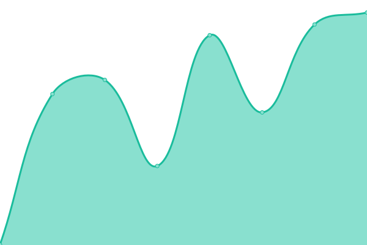
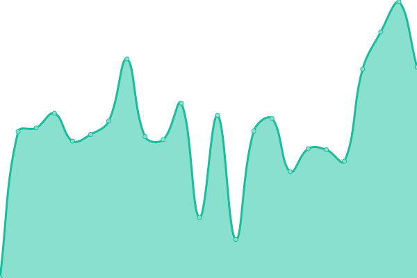

# [📈 Live Status](https://demo.upptime.js.org): <!--live status--> **🟧 Partial outage**

This repository contains the open-source uptime monitor and status page for [Parsepoint Inc.](https://demo.upptime.js.org), powered by [Upptime](https://github.com/upptime/upptime).

With [Upptime](https://upptime.js.org), you can get your own unlimited and free uptime monitor and status page, powered entirely by a GitHub repository. We use [Issues](https://github.com/Parsepoint-Software/upptime/issues) as incident reports, [Actions](https://github.com/Parsepoint-Software/upptime/actions) as uptime monitors, and [Pages](https://demo.upptime.js.org) for the status page.

<!--start: status pages-->
<!-- This summary is generated by Upptime (https://github.com/upptime/upptime) -->
<!-- Do not edit this manually, your changes will be overwritten -->
<!-- prettier-ignore -->
| URL | Status | History | Response Time | Uptime |
| --- | ------ | ------- | ------------- | ------ |
|  [Parsepoint App](https://app-parsepoint.com) | 🟩 Up | [parsepoint-app.yml](https://github.com/Parsepoint-Software/upptime/commits/HEAD/history/parsepoint-app.yml) | 

 609ms
     
 | 

<a href="https://status.parsepoint.com/history/parsepoint-app">99.83%</a>
    

|  [Parsepoint API](https://api.app-parsepoint.com/api/health/) | 🟩 Up | [parsepoint-api.yml](https://github.com/Parsepoint-Software/upptime/commits/HEAD/history/parsepoint-api.yml) | 

 268ms
     
 | 

<a href="https://status.parsepoint.com/history/parsepoint-api">100.00%</a>
    

|  [Celery Worker](18.219.131.79) | 🟥 Down | [celery-worker.yml](https://github.com/Parsepoint-Software/upptime/commits/HEAD/history/celery-worker.yml) | 

 0ms
     
 | 

<a href="https://status.parsepoint.com/history/celery-worker">100.00%</a>
    

|  [Parsepoint Website](https://parsepoint.com) | 🟩 Up | [parsepoint-website.yml](https://github.com/Parsepoint-Software/upptime/commits/HEAD/history/parsepoint-website.yml) | 

 348ms
     
 | 

<a href="https://status.parsepoint.com/history/parsepoint-website">93.76%</a>
    

<!--end: status pages-->

[**Visit our status website →**](https://demo.upptime.js.org)

## 📄 License

- Powered by: [Upptime](https://github.com/upptime/upptime)
- Code: [MIT](./LICENSE) © [Anand Chowdhary](https://anandchowdhary.com), supported by [Pabio](https://pabio.com)
- Data in the `./history` directory: [Open Database License](https://opendatacommons.org/licenses/odbl/1-0/)
